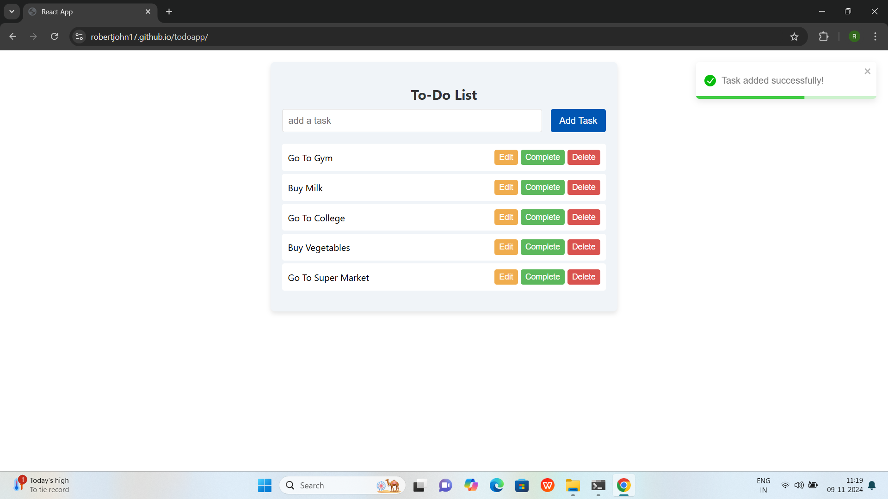

# React Todo App

A simple and user-friendly Todo application built with React. This app allows users to add, edit, delete, and mark tasks as complete, helping to manage daily tasks efficiently.

## Table of Contents

- [Features](#features)
- [Demo](#demo)
- [Installation](#installation)
- [Usage](#usage)
- [Technologies Used](#technologies-used)
- [Contributing](#contributing)
- [License](#license)

---

## Features

- **Add Tasks**: Quickly add new tasks to the list.
- **Edit Tasks**: Modify existing tasks.
- **Delete Tasks**: Remove tasks when no longer needed.
- **Complete Tasks**: Mark tasks as complete and visually distinguish them from pending tasks.
- **Filter Tasks**: Optionally filter tasks by status (all, completed, or pending).

---

## Demo

Include some sample screenshots of the application for a quick preview:

- 

You can check out the live demo [https://robertjohn17.github.io/todoapp/](#) (Add a link if available).

---

## Installation

To set up and run this project locally, follow these steps:

### Prerequisites

- Node.js

### Clone the Repository

Clone the project repository and navigate to the project directory:

```bash
git clone https://github.com/your-username/todo-app.git
cd todo-app

npm install
npm start

```
The app will run on http://localhost:3000.

## Usage 

1. Add a New Task: Enter the task title in the input field and click the "Add" button to create a new task.
2. Edit an Existing Task: Click on the "Edit" button next to a task to modify it. Update the task details and save changes.
3. Mark Task as Complete: Click on the checkbox or "Complete" button to mark a task as complete. Completed tasks will be visually distinct.
4. Delete a Task: Click on the "Delete" button next to a task to remove it from the list.

## Technologies Used

- Frontend: React
- Styling: CSS


